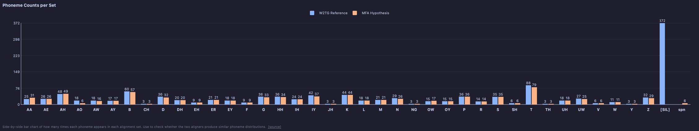

# plot_phoneme_counts

Side-by-side bar chart showing how many times each phoneme appears in each alignment set. Use to check whether the two aligners produce similar phoneme distributions.



*Click to zoom.*

## Example

```python
from alignment_comparison_plots import plot_phoneme_counts

plot_phoneme_counts(
    paths_a=paths_a,
    paths_b=paths_b,
    label_a="W2TG Reference",
    label_b="MFA Hypothesis",
    aggregate_emphasis=True,
)
```

Implements [`PlotFunction`](shared.md#plotfunction).