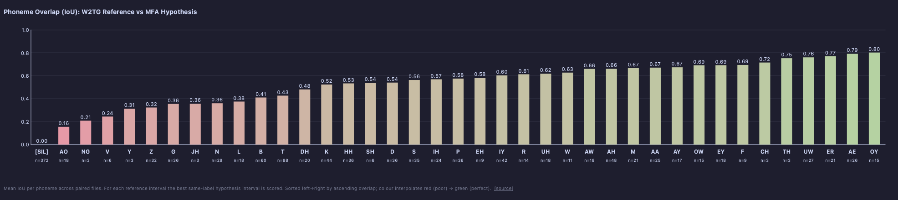

# plot_phoneme_overlap

Mean IoU per phoneme across paired files. For each reference interval the best same-label hypothesis interval is scored. Bars are sorted ascending left→right; colour interpolates red (poor overlap) → green (perfect overlap).



*Click to zoom.*

## Example

```python
from alignment_comparison_plots import plot_phoneme_overlap

plot_phoneme_overlap(
    paths_a=paths_a,
    paths_b=paths_b,
    label_a="W2TG Reference",
    label_b="MFA Hypothesis",
    aggregate_emphasis=True,
)
```

Implements [`PlotFunction`](shared.md#plotfunction).
