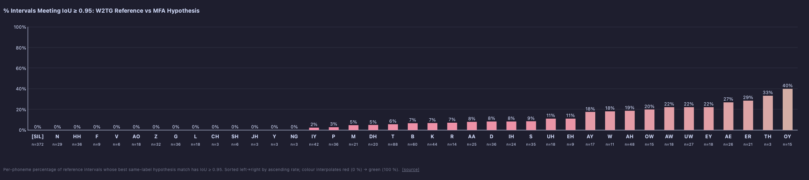

# plot_phoneme_overlap_rate

Percentage of reference intervals whose best same-label hypothesis match meets an IoU threshold. Bars sorted ascending left→right; colour interpolates red → green.



*Click to zoom.*

## Example

```python
from alignment_comparison_plots import plot_phoneme_overlap_rate

plot_phoneme_overlap_rate(
    paths_a=paths_a,
    paths_b=paths_b,
    label_a="W2TG Reference",
    label_b="MFA Hypothesis",
    aggregate_emphasis=True,
    threshold=0.5,
)
```

Implements [`PlotFunctionWithThreshold`](shared.md#plotfunctionwiththreshold).
