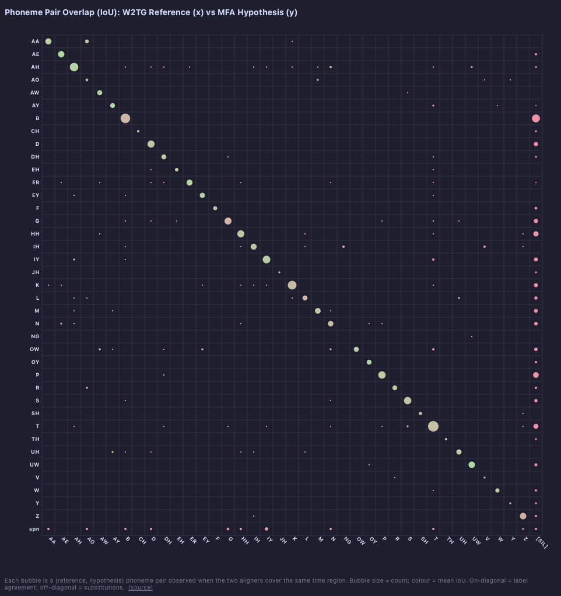

# plot_phoneme_pair_scatter

Grid scatter of (reference phoneme, hypothesis phoneme) pairs. Bubble size is proportional to observation count; colour represents mean IoU (red → green). On-diagonal bubbles indicate label agreement; off-diagonal bubbles indicate substitutions.



*Click to zoom.*

## Example

```python
from alignment_comparison_plots import plot_phoneme_pair_scatter

plot_phoneme_pair_scatter(
    paths_a=paths_a,
    paths_b=paths_b,
    label_a="W2TG Reference",
    label_b="MFA Hypothesis",
    aggregate_emphasis=True,
)
```

See [Shared parameters](shared.md) for all common parameters.
